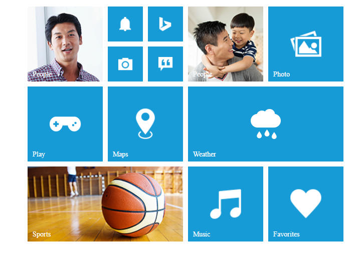

# Add Group Tiles

To make a **Tile** as grouped tile, you can use the following mentioned pre-defined classes.

<table>
<tr>
<th>
Class Name</th><th>
Explanation</th></tr>
<tr>
<td>
e-tile-group</td><td>
To group the column elements</td></tr>
<tr>
<td>
e-tile-column</td><td>
To align the tile in column manner</td></tr>
<tr>
<td>
e-tile-small-col-2</td><td>
To align the small size tiles</td></tr>
</table>

Refer to the following code example for render the Group tiles.



    

        

               <!— Add tile control here -->
        

    



To render **column** grouped tile, you need to render the number of tiles inside a **&lt;div&gt;** element with class **e-tile-column**. Then that column group element is appended to a **&lt;div&gt;** with class **e-tile-group**.     

To render **small-col-2** grouped tile, you need to render the number of tiles inside a **&lt;div&gt;** element with class **e-tile-small-col-2**. Then that **small-col-2** group element is appended to a **&lt;div&gt;** with class **e-tile-column**. Then you need to append those column inside the main group **&lt;div&gt;** element.                                                     

Refer the following code examples.


    
    

         

              

              

               

                    

                    

                    

                    

                    

                    

                    

                    

               

               

               

               

               

               

               

        

        

               

               

               

               

               

               

               

               

               

               

        

   



