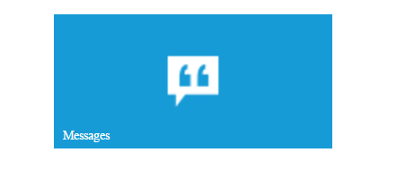
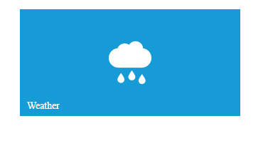

# Appearance and Customization

## TileSize Customization

To customize the Tile component size by using tileSize property. By default tile size as small. The following built-in tile sizes are supported.

1. medium
2. small
3. wide
4. large

Refer to the following code examples.


    
    

    
 
    
   

## Image and Position Configuration

   1) To set the image position by using the imagePosition property for Tile component. By default tile image as in center position. Get the possible [image position](https://help.syncfusion.com/api/js/ejtile#members:imageposition)

   2) The imageUrl property is used to set the background image for Tile component.

   Refer to the following code example.

   

    

    
  
    
   
 

## Applying Rounded Corner

To use [showRoundedCorner](https://help.syncfusion.com/api/js/ejtile#members:showroundedcorner) property to add the rounded borders for the Tile component. By default, showRoundedCorner property is disabled in Tile.



    

    
  
     


## Allow Selection

To use [Allow Selection](https://help.syncfusion.com/api/js/ejtile#members:allowselection) property to select the Tile component. By default, selection is disabled in Tile.



    

    
 



## Css Class

Tile component also allows you to customize its appearance using user-defined CSS and custom skin options such as colors and backgrounds. To apply custom themes you have a property called **cssClass**. **cssClass** property sets the root class for **Tile** theme.

Using this **cssClass** you can override the existing styles under the theme style sheet. The theme style sheet applies theme-specific styles like colors and backgrounds. In the following example, the value of **cssClass** property is set as **customClass**. **customClass** is added as root class to **Tile** component at the runtime. From this root class you can customize the **Tile** component theme.

Add the following code in your **HTML** page to render the Tile.


 
     

     
  
    


In the following style sheet the existing theme style sheet file has been over-ridden using root class **customClass**. 

Add the following code in your style section.





