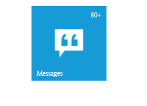

# Badge Configuration

The badge property handles badge specific functionalities like enable or disable the badge and setting badge value for Tile.

The **enabled** attribute enables or disables the badge for a Tile. The Tile renders with hidden badge when it is set as false.

The **value** attribute is used to set the badge value to a Tile. By default, the Value is set to **1** on initialization. 

The **text** attribute is used to set the text instead of number for Tile badge. 

The **maxValue** attribute is used to set the maximum badge value to a Tile. When you set the badge value greater than maxvalue, it shows maximum value in badge with **plus** symbol. 

The **minValue** attribute is used to set the minimum badge value to a Tile. When you set the badge value less than minvalue, it shows minimum value in badge.

The **position** attribute is used to set the position for badge text or badge value. By default, the badge value position as bottomright.

Refer to the following code examples.



    

    
      
    




       $scope.badge = { enabled: true, minValue: 10, maxValue: 80, value: 88, position: "topright" };



