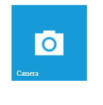

# Caption Configuration

The caption property handles some specific functionalities like enable or disable the caption and setting caption text for Tile.

The **enabled** attribute enables or disables the caption for a Tile. The Tile renders with hidden caption when it is set as false.

The **text** attribute is used to set the caption text for Tile.

The **icon** attribute is used to set the caption icon for tile instead of text. 

The **position** attribute is used to set the position for caption text. By default, the caption text position as innerbottom.

The **alignment** attribute is used to align the text or icon of tile component. 

The caption property handles specific functionalities like enable or disable the caption text, position and alignment. Get the possible [caption fields](https://help.syncfusion.com/api/js/ejtile#members:caption) 



  

  
  





 $scope.caption = { enabled: true, text: "Camera", position: "innerbottom" };



