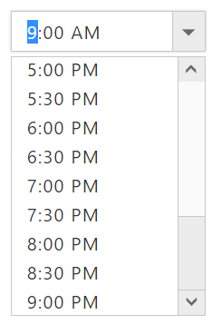

# Behavior Settings

## Set value

 You can use **e-value** property to set default time for the **TimePicker**. **TimePicker** value API is two way binding enabled API that can be accessed using **“e-value attribute”**. This API value could be set either as a Time object or a formatted string.
 
 **HTML View Section**

 

     <input id="timepicker" ej-timepicker e-value="value" />

 
 
 **Controller Section**

 

        



Run the above code to render the following output.

## Time Range

Time selection can be restricted using our offered APIs **e-minTime** and **e-maxTime**, which is used to set the minimum time that can be selected and minimum time range that can be chosen. These APIs value can be updated directly in inline, else via scope also.

**e-minTime**: Specifies the minimum time to be picked in **TimePicker**  by disabling below time of **minTime**.

**e-maxTime**: Specifies the maximum time to be picked in **TimePicker**  by disabling above time of **maxTime**.

**HTML View Section**



     <input id="timepicker" ej-timepicker e-minTime="minTime" e-maxTime="maxTime"/>



**Controller Section**



        



Run the above code to render the following output.

## Enable/Disable

**TimePicker** widget provides you an option to **enable /disable** the widget. You can disable the **TimePicker** by setting the **“e-enabled”** property value as false. Disabling the controls will unbind the all UI interactions of components. 

Check with the below code for disabling the component,

**HTML View Section**



     <input id="timepicker" ej-timepicker e-value="value" e-enabled="true" />



**Controller Section**



        



Run the above code to render the following output.

**HTML View Section**



     <input id="timepicker" ej-timepicker e-enabled="false" />



**Controller Section**



        



Run the above code to render the following output.

## ReadOnly

**TimePicker** widget provides **e-readOnly** property to disable editing in the control. Therefore, you can only read the value set to **TimePicker** and cannot modify it.

**HTML View Section**



     <input id="timepicker" ej-timepicker e-readOnly="true" />



**Controller Section**



        



**Interval**

**TimePicker** widget provides you an option to change the intervals between the of the **hours/ minutes /seconds** in a popup. **TimePicker** component have below available options to change the intervals based on application needs.

<table>
<tr>
<th>Sl.No</th>
<th>Property Name</th>
<th>Description</th>
<th>Default Value</th>
</tr>
<tr>
<td>1.</td>
<td>e-hourInterval</td>
<td>Sets the step value for increment an hour value through arrow keys or mouse scroll.</td>
<td>1</td>
</tr>
<tr>
<td>2.</td>
<td>e-minutesInterval</td>
<td>Sets the step value for increment the minute value through arrow keys or mouse scroll.</td>
<td>1</td>
</tr>
<tr>
<td>3.</td>
<td>e-secondsInterval</td>
<td>Sets the step value for increment the seconds value through arrow keys or mouse scroll.</td>
<td>1</td>
</tr>
</table>

**HTML View Section**



     <input id="timepicker" ej-timepicker e-value="value" e-timeFormat="timeFormat" e-hourinterval="hourinterval" e-minutesinterval="minutesinterval" e-secondsinterval="secondsinterval"/>



**Controller Section**



        
        


Run the above code to render the following output.

