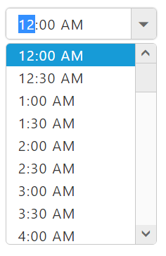
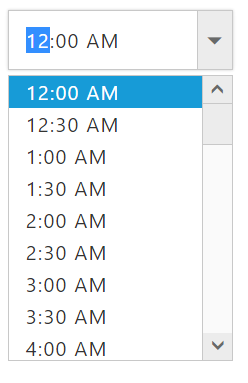
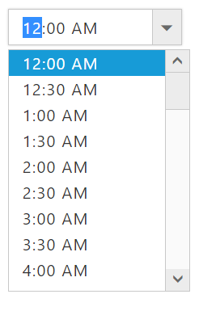

# Customization

## Rounded Corner

**e-showRoundedCorner** property is used to display the **TimePicker** control with rounded corners. By default, **showRoundedCorner** is in **disabled state**.

**HTML View Section**



     <input id="timepicker" ej-timepicker e-showRoundedCorner="true" />



**Controller Section**



        



Run the above code to render the following output.

## Height/Width
You can use **e-height** and **e-width** property to customize TimePicker **width** and **height**.

**HTML View Section**



     <input id="timepicker" ej-timepicker e-height="height" e-width="width"/>



**Controller Section**



        



Run the above code to render the following output.

## PopupHeight and PopupWidth

You can use **e-popupHeight** and **e-popupWidth** property to customize **TimePicker popup width and height**.

**HTML View Section**



     <input id="timepicker" ej-timepicker e-popupHeight="popupHeight" e-popupWidth="popupWidth"/>



**Controller Section**



        



Run the above code to render the following output.

