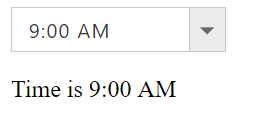
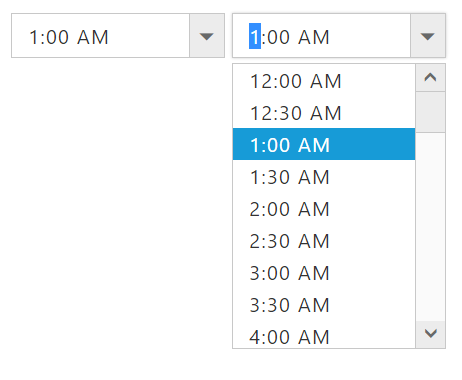

# Data and Event Binding

## Data Binding

**Data binding** in **AngularJS** is the synchronization between the model and the view. **Data binding** is an approach where a value is taken from the data model and inserted into an HTML element. There is no way to update model from view.

**HTML View Section**



     <input id="timepicker" ej-timepicker e-value="value" />
     
Time is {{value}}



**Controller Section**



            



Run the above code to render the following output.

## Event Binding

Component events and captured and processed based on application needs. These events can be registered with scope to enhance the component functionality with **AngularJS**. Please refer the below code example,

**HTML View Section**



     <input id="timepicker" ej-timepicker e-change="valuechanged"/>



**Controller Section**



        



## Two-way Binding

In **AngularJS** framework, any changes to view proximately update to model, any changes in model directly updated with view rapidly.With **TimePicker** control, value API enabled with two way binding to achieve this delightful functionality. 

Please refer the below code example,

**HTML View Section**



     <input id="timepicker1" ej-timepicker  e-value="value"/>
     <input id="timppicker2" ej-timepicker  e-value="value"/>



**Controller Section**



        



Run the above code to render the following output.

