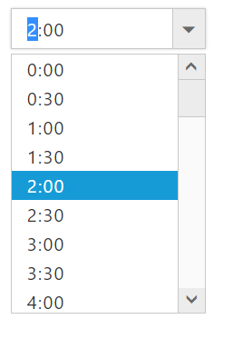

# Globalization 

**TimePicker** has been provided with Built-in localization support, so that it will be able adapt based on culture specific locale defined for it.
**ej.globalize** library is used to globalize **TimePicker**. Globalize values will be automatically used when **e-locale** property is set with locale string value for example fr-FR.

More than 350 culture specific files are available to localize the date. To know more about **EJ globalize support**,[please refer the below link](http://help.syncfusion.com/js/localization)

To translate our control content from default English to any of the culture, say For example – **Chinese language**, then you need to refer the **ej.culture.zh-CN.min.js** file in your application,
The en-US locale is currently being used as default culture in **TimePicker**. You can set any other culture to **TimePicker** by using **e-Locale** property. Below code example shows **Chinese** cultured **TimePicker**.

Refer the below Chinese culture file in head section of HTML page after the reference of ej.web.all.min.js file.

**HTML View Section**



     <input id="timepicker" ej-timepicker e-value="value" e-locale="locale" />



**Controller Section**



        



Execute the above code to render the following output.

