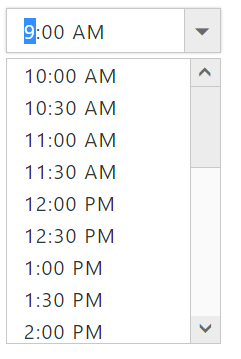

# Strict mode

Input the **valid** and **invalid** value behavior can be personalized with **e-enablestrictmode**. Setting false to this API, we can enter the valid date only and restrict other invalid dates. Providing wrong date will be set to previous value. By setting false invalid date can be entered but with e-error class. 

When the **e-enableStrictMode** is set as true it allows the value outside of the range and also indicate with red color border, otherwise it internally changed to the min or max range value based an input value.

**HTML View Section**



     <input id="timepicker" ej-timepicker e-value="value" e-enableStrictMode="true" e-minTime="minTime" e-maxTime="maxTime"/>



**Controller Section**



        



Run the above code to render the following output.

