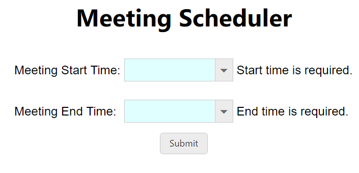
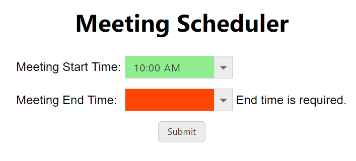
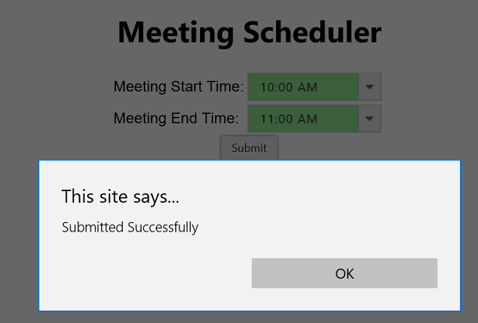

# Validation

**EJ AngularJS TimePicker** is a form control and can be used within **ng-form**. This will support with the **AngularJS validation** and update the AngularJS validation related built-in classes to element based on current state of the element.

State of the element can be **touched/dirty/valid**, based on this states corresponding classes will be add to control. These classes will be used to identify the state and picturing the components based on these using CSS in order to provide easily understandable validation status. To know more about **AngularJS Form Validation** and related classes please refer below

Just adding the **e-value** bounded component inside the ng-form, will work suitably with **AngularJS validation.**

**HTML View Section**



    <ng-form name="timeForm" ng-submit="submitForm()">
        <h1>Meeting Scheduler</h1>
          

            <table>
                <tr>
                    <td>Meeting Start Time:</td>
                    <td>
                        <input id="timepicker1" e-value="value" ej-timepicker name="starttime" e-mintime="mintime1" e-maxtime="maxtime1" required />
                    </td>
                    <td>
                        
Start time is required.

                    </td>
                </tr>
                <tr>
                    <td>Meeting End Time:</td>
                    <td>
                        <input id="timepicker2" e-value="value" ej-timepicker name="endtime" e-mintime="mintime2" e-maxtime="maxtime2" required />
                    </td>
                    <td>
                        
End time is required.

                    </td>
                </tr>
            </table>
        

       <button id="button" ej-button type="submit" e-text="Submit" e-size="mini" e-showRoundedCorner="true" e-click="submitForm" ng-disabled="timeForm.$invalid"></button>
    </ng-form>



Refer the below code for  uses the CSS to display validity of each form control.

**AngularJS**  provides classes and properties on the form and its inputs so that you can style each state accordingly. Those classes are **ng-valid**, **ng-invalid**, **ng-pristine**, **ng-dirty**, **ng-touched**, **ng-required**, **ng-show**, **ng-disabled**.



      



**Controller Section**

Add the following code in your script section to validate the form with **TimePicker** control.



             



Run the above code to render the following output.

