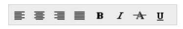

# Data binding

**Toolbar** provides you a flexible approach for binding data from various data sources. There are various properties in **Toolbar** for Data Binding.

## Data fields and configuration 

The following sub-properties provides a way to bind either the local/remote data to the **Toolbar** control.

Property Table of JavaScript Toolbar control

<table>
<tr>
<th>
Property</th><th>
Syntax</th><th>
Description</b></th></tr>
<tr>
<td>
dataSource</td><td>
dataSource: window.countriesField</td><td>
It specifies the data source of the Toolbar. The data source contains the list of data for generating the Toolbar items. By default, its value is null and its data type is object. </td></tr>
<tr>
<td>
field</td><td>
fields: {text: "name", value: "key" }</td><td>
It specifies the mapping fields for the data items of the Toolbar. By default, its value is null and its data type is object.</td></tr>
<tr>
<td>
query</td><td>
query: ej.Query().from("Suppliers").select("ContactName");       	 </td><td>
It specifies the query to retrieve the data from online server. By default, its value is null and its data type is object. </td></tr>
<tr>
<td>
id</td><td>
id</td><td>
It specifies the id of the tag and its default value is null and data type is string. </td></tr>
<tr>
<td>
text</td><td>
text</td><td>
It specifies the text content of the tag and its default value is null and data type is string. </td></tr>
<tr>
<td>
imageUrl</td><td>
imageUrl</td><td>
This property defines the imageURL for the image location. While setting images, the folder name in which the images are stored should be set to imageUrl property. The value set to this property should be <b>string</b> type.</td></tr>
<tr>
<td>
imageAttributes</td><td>
imageAttributes</td><td>
This property defines style for the image. While setting an image, styles can be applied such as height, width by using this property. The value set to this property should be <b>string</b> type.</td></tr>
<tr>
<td>
spriteCssClass</td><td>
spriteCssClass</td><td>
This property sets the Sprite CSS for the image tag in Toolbar. The value set to this property should be <b>string</b> type.</td></tr>
<tr>
<td>
htmlAttributes</td><td>
htmlAttributes</td><td>
This property sets the <b>HTML</b> attribute for the Toolbar item. The value set to this property should be <b>object</b> type. It can be any <b>HTML</b> attribute such as id, class, style.</td></tr>
<tr>
<td>
tooltipText  </td><td>
tooltipText  </td><td>
This property sets the text value for Toolbar item while mouse over in Toolbar. The value set to this property should be <b>string</b> type.</td></tr>
</table>

In data binding concept of Toolbar control, need to set the field values using two way binding that is you need to assign the values of the fields using scope variable.

The following code example depicts you the way to bind data to the **Toolbar** widget.


    

    

    





    var list = [{
        iconid: "1",
        spriteCss: "ToolbarItems LeftAlign_tool",

    }, {
        iconid: "2",
        spriteCss: "ToolbarItems CenterAlign_tool",
    }, {
        iconid: "3",
        spriteCss: "ToolbarItems RightAlign_tool",
    }, {
        iconid: "4",
        spriteCss: "ToolbarItems Justify_tool",

    }, {
        iconid: "5",
        spriteCss: "ToolbarItems Bold_tool",
    }, {
        iconid: "6",
        spriteCss: "ToolbarItems Italic_tool",
    }, {
        iconid: "7",
        spriteCss: "ToolbarItems StrikeThrough_tool",
    }, {
        iconid: "8",
        spriteCss: "ToolbarItems Underline_tool",
    }
    ];

    angular.module('toolApp', ['ejangular']).controller('ToolCtrl', function ($scope) {
        $scope.dataList = list;
    });







