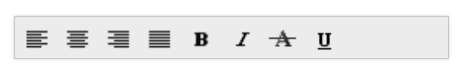
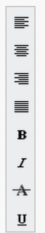

# Orientation

The **Toolbar** control supports both vertical and horizontal orientations, allowing it to fit into any scenario. The [orientation](https://help.syncfusion.com/api/js/ejtoolbar#members:orientation) property **of Toolbar** defines the orientation in which the control is rendered. Set the value to this property as **enum or string** type. It accepts the following values.

* ej.Orientation.Horizontal or "Horizontal"
* ej.Orientation.Vertical  or "Vertical"

The following section explains you on how to set orientation for the toolbar.

## Horizontal

This property sets the **Toolbar** in **horizontal** orientation. You can refer the following steps to set horizontal orientation for **Toolbar** control.

Add the following code in your **HTML** page.







angular.module('ToolbarApp', ['ejangular'])
.controller('ToolbarCtrl', function ($scope) {
    $scope.orient = ej.Orientation.Horizontal;

});



OR





Build and run the application.

The following screenshot illustrates a **Toolbar** with horizontal orientation.

## Vertical

This property sets the **Toolbar** in **vertical** orientation. You can refer the following steps to set vertical orientation for **Toolbar** control.

Create UL-LI list of toolbar items and invoke the toolbar helper.

Add the following script in your **HTML** page.



    

    





angular.module('ToolbarApp', ['ejangular'])
.controller('ToolbarCtrl', function ($scope) {
    $scope.orient = ej.Orientation.Vertical;

});



OR


  



Build and run the application.

The following screenshot illustrates a **Toolbar** with vertical orientation.

