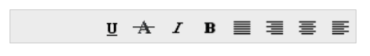

# RTL

This feature allows you to change the left-to-right alignment of the **Toolbar** to right-to-left (**RTL**) that sets the **Toolbar** to do its actions from right to left. The [enableRTL](https://help.syncfusion.com/api/js/ejtoolbar#members:enablertl) property sets the **Toolbar** from right to left. Set the value to this property as **Boolean** type.





