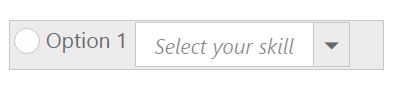

# Template Support

Template allows you to insert custom controls inside the toolbar items. Also you can design simple drop down buttons listing the items and radio button inside the **Toolbar**.

Set the list for **DropDown control** inside a list tag and define this tag as a **Toolbar** item. You can use all simple controls as a **Toolbar** item. To add RadioButton and DropDownList to **Toolbar**, use the following code example.



    <ul>
        <li>
            <input type="radio" name="small" id="Radio1" ej-radiobutton e-size="medium" />
            Option 1
        </li>
        <li id="Dropdown" title="Dropdown Control">
            <input id="selectcar" type="text" ej-dropdownlist e-datasource="dataList" e-fields-text="skill" e-watermarktext="Select your skill" />

        </li>
    </ul>





var skillset = [
        { skill: "ASP.NET" }, { skill: "ActionScript" }, { skill: "Basic" },
        { skill: "C++" }, { skill: "C#" }, { skill: "dBase" }, { skill: "Delphi" },
        { skill: "ESPOL" }, { skill: "F#" }, { skill: "FoxPro" }, { skill: "Java" },
        { skill: "J#" }, { skill: "Lisp" }, { skill: "Logo" }, { skill: "PHP" }
];
angular.module('ToolbarApp', ['ejangular'])
.controller('ToolbarCtrl', function ($scope) {
    $scope.dataList = skillset;
});



The following screenshot displays a Toolbar with embedded controls.

