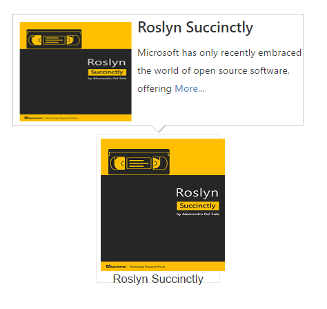

# Customization

## Template Support

By default you can add any text or image to the Tooltip. To customize the tooltip layout or to create your own visualized elements you can use this template support.



        
        
Roslyn Succinctly

    


### Tooltip’s title customization

Tooltip title can be customized with the image or any HTML element. 


    

    
    
Roslyn Succinctly



## Animation Effects

Determines the type of effect that takes place when showing/hiding the tooltip.

We can specify the effect and the duration for the animation. 

<table>
<tr>
<td>
Effects </td><td>
Description </td></tr>
<tr>
<td>
Slide </td><td>
Sliding animation effect takes place with a duration of 200ms. </td></tr>
<tr>
<td>
Fade </td><td>
Fading animation effect takes place with a duration of 800ms. </td></tr>
<tr>
<td>
None (Default) </td><td>
No effect takes place </td></tr>
</table>

Let's create a Tooltip that slides down when shown using the [animation](http://help.syncfusion.com/api/js/ejtooltip#members:animation) property:



     TypeScript lets you write <a id="test" ej-tooltip e-content="content" e-animation="animation"><u> JavaScript</u> </a>the way you really want to.

    


### Custom Animation

Custom animation effect for both Tooltip show/hide can also be done by [show](http://help.syncfusion.com/api/js/ejtooltip#methods:show) and [hide](http://help.syncfusion.com/api/js/ejtooltip#methods:hide) method.

Show or Hide method may receive an optional 'callback' parameter, which represents a function you'd like to call which will animate the tooltip.

N> Show or Hide method can also receive an optional parameter “effect name”, (e.g any easing effect name) which specifies the type of effect taken place when showing/hiding of the tooltip.

## Modernize the tooltip’s content

It's easy to update a tooltip’s content – whether it’s open or closed. You can use the [content](https://help.syncfusion.com/api/js/ejtooltip#members:content) property of Tooltip in order to give th tooltip content.

## Closing Mode

By default, the Tooltip will be hidden when mouse leaves the target element. Different types of close mode as follows 

<table>
<tr>
<td>
Types </td><td>
Description </td></tr>
<tr>
<td>
Auto </td><td>
Tooltip will be hidden after a particular period of time. </td></tr>
<tr>
<td>
Sticky </td><td>
Tooltip rendered with the button, it will close the tooltip. </td></tr>
<tr>
<td>
None (Default) </td><td>
Tooltip will be hidden when mouse leaves the target element. </td></tr>
</table>

### Auto

The tooltip will be visible only for the period of time specified in the [autoCloseTimeout](http://help.syncfusion.com/api/js/ejtooltip#members:autoclosetimeout).

Let see an example, this Tooltip will only hide after hovering the target for 2000ms



     TypeScript lets you write <a id="test" ej-tooltip e-content="content" e-closemode="mode" e-autoclosetimeout="2000"><u> JavaScript</u> </a>the way you really want to.

    


N> Time specified in the autoCloseTimeout will be in milliseconds and the default value is 4000ms

### Sticky

A close button will be shown with the Tooltip. The button element (i.e. close button) located by default at the top right of the Tooltip or title bar (if title is enabled). The tooltip gets closed when the button is clicked.



     TypeScript lets you write <a id="test" ej-tooltip e-content="content" e-closemode="mode"><u> JavaScript</u> </a>the way you really want to.

    



You can also have Tooltip with a title, in which case the button will lye within it:



  

        TypeScript lets you write <a id="test" ej-tooltip e-content="content" e-title="title" e-closemode="mode"><u> JavaScript</u> </a>the way you really want to.
  

  
   
   


