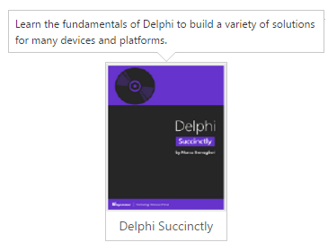

# Getting started

## Preparing HTML document

The Tooltip control has the following list of external JavaScript dependencies. 

* [jQuery](http://jquery.com/) 1.7.1 and later versions

* [jQuery.easing](http://gsgd.co.uk/sandbox/jquery/easing/) - to support animation effects in the components

Refer to the internal dependencies in the following table.

<table>
<tr>
<th>
File                                </th><th>
Description/Usage</th></tr>
<tr>
<td>
ej.core.min.js</td><td>
It is referred always before using all the JS controls.</td></tr>
<tr>
<td>
ej.tooltip.min.js</td><td>
The Tooltip's main file.</td></tr>
</table>

To get started, you can use the `ej.web.all.min.js` file that encapsulates all the `ej` controls and frameworks in one single file. So the complete boilerplate code is



    <!DOCTYPE html>
    <html ng-app="ToolApp">
    <head>
    <meta name="viewport" content="width=device-width, initial-scale=1.0" charset="utf-8" />
    <!-- Style sheet for default theme (flat azure) -->
    <link href="http://cdn.syncfusion.com/{{ site.releaseversion }}/js/web/flat-azure/ej.web.all.min.css" rel="stylesheet" />
    <!--Scripts-->
    
    
	
    
	
    <!--Add custom scripts here -->
    </head>
     <body ng-controller="ToolCtrl">
    <!-- add necessary HTML elements here -->
    </body>
    </html>



N> In production, we highly recommend you to use our [custom script generator](http://helpjs.syncfusion.com/js/include-only-the-needed-widgets)  to create custom script file with required controls and its dependencies only. Also to reduce the file size further please use [GZip compression](https://developers.google.com/web/fundamentals/performance/optimizing-content-efficiency/optimize-encoding-and-transfer?hl=en) in your server.

For themes, you can use the `ej.web.all.min.css` CDN link from the code example given. To add the themes in your application, please refer to [this link](http://help.syncfusion.com/js/theming-in-essential-javascript-components).

## Create a Tooltip

The Tooltip can be created from any HTML element with the HTML `id` attribute and pre-defined options set to it. To create the Tooltip  refer to the following code example.


 
    

      

        
        
Delphi Succinctly

     

    

    // Creates the Tooltip





       
 


Apply the following style sheet



    
    


## Setting Dimensions

Tooltip dimensions can be set using [width](http://help.syncfusion.com/js/api/ejtooltip#members:width) and [height](http://help.syncfusion.com/js/api/ejtooltip#members:height) API.


 
       

             TypeScript lets you write <a id="test" ej-tooltip e-content="content1" e-width="width" e-height="height"><u> JavaScript </u> </a>the way you really want to
       
 
       // Creates the Tooltip




      
      
    


## Tooltip Appearance 

You can configure the appearance of the Tooltip with the title, close button and call out as your application requires.


 
      

          

              
              
Delphi Succinctly

           

      

    // Creates the Tooltip



Apply the following styles to show the Tooltip.



     
    


