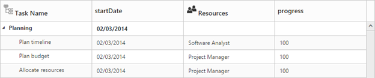
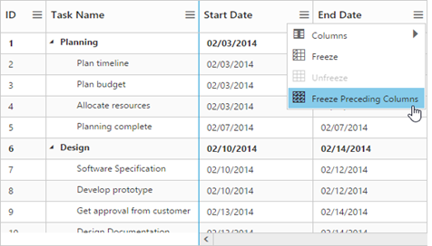

# Columns

Column definitions that is specified in the **e-columns** option, defines how to display, format, and edit data in the **e-datasource** in tree grid control. The values in the **e-datasource** can be mapped to the appropriate column using the **‘field’** property of the corresponding column object.                 

## Formatting

The values in each column can be formatted using the **‘format’** property of column object.                               

The following example shows how to specify the numeric format string to display currency, percentage symbols, and date values in a column.          

                    
                                                           
<!doctype html>
<body ng-controller="TreeGridCtrl">
    <!--Add  treegrid control here-->
    

    

    
</body>



Note: For more numeric format strings, refer to this [link](https://msdn.microsoft.com/library/dwhawy9k(v=vs.100).aspx).

For more date format strings, refer to this [link](https://msdn.microsoft.com/library/az4se3k1(v=vs.100).aspx).                         
               
## Headers

### Header text

Using the **e-columns.headerText** property, you can provide title for a specific column. The following code sample shows how to set header text for the columns.



<!doctype html>
<body ng-controller="TreeGridCtrl">
    <!--Add  treegrid control here-->
    

    

    
</body>



### Text wrapping

When the content exceeds the column width, you can wrap the header text or title of the column using the **e-headertextoverflow** property. By default this property is set to **none**. To enable header text wrapping , set the **e-headertextoverflow** property to **‘wrap’**. The following code sample demonstrates this.



<!doctype html>
<body ng-controller="TreeGridCtrl">
    <!--Add  treegrid control here-->
    
        
    

</body>



### Header Template

Using the **e-columns.headerTemplateID** property, you can specify the script element ID, which contains the JsRender template to the specific column.

The following code sample shows how to set the header template.                 



<body ng-controller="TreeGridCtrl">
    
    
    <!--Add  treegrid control here-->
    

    

    
</body>
    



The following screenshot depicts column headers with custom templates.

## Frozen Columns

Specific columns can be frozen by enabling the **e-columns.isFrozen** property of the respective column object. The columns that are frozen remains static while scrolling the content horizontally. You can also freeze or unfreeze a column during runtime by selecting Freeze or Unfreeze menu item in the column menu. These set of menu options will be displayed in all the columns when the **e-columns.isFrozen** property is enabled in any of the columns. However, you can control the visibility of these menu options in a particular column by enabling or disabling the **e-columns.allowFreezing** property of that specific column.    

 

<body ng-controller="TreeGridCtrl">
    <!--Add  treegrid control here-->
    

    

    
</body>



The following screenshot depicts tree grid with frozen columns.

You can also freeze all the preceding columns by choosing *Freeze Preceding Columns* option in the column menu.               

## Resizing

You can resize the column width to view the hidden text of the cell. This feature can be enabled by setting the **allowColumnResize** property to true.



<body ng-controller="TreeGridCtrl">
    <!--Add  treegrid control here-->
    

    

</body>



## Column Template

Columns can be customized either by using JsRender templates or by AngularJS templates.

Using the **e-columns.templateID** property, you can specify the script element ID, which contains the template for the column. However, enable the **e-columns.isTemplateColumn** property for the specific column to display the custom template instead of default template.

The following code example shows how to define template for the column.



<body ng-controller="TreeGridCtrl">
    <!--Add  TreeGrid control here-->
    

    

    
</body>



## Column Menu

Column menu can be displayed in column header by enabling the **‘e-showcolumnchooser’**.

The following are the items displayed in the column menu:

* **Column Chooser**: Displays all the column names. You can enable or disable a column by selecting or deselecting the respective column name in the column chooser menu.
* **Sort Ascending & Sort Descending**: Sorts the items in the column. These menu options will be displayed only when you set the **e-allowsorting** property to true. To perform multilevel sorting, the **‘e-allowmultisorting’** property should be enabled.               
* **Freeze, Unfreeze & Freeze Preceding Columns**: Freezes or unfreezes the columns. These set of menu options will be displayed in all columns when the **e-columns.isFrozen** property is enabled. However, you can control the visibility of these menu options in a particular column by enabling or disabling the **e-columns.allowFreezing** property of that specific column.                         



<body ng-controller="TreeGridCtrl">                  
    <!--Add  TreeGrid control here-->
    

    

    
</body>



## Changing position of expander column

The position of the expander column, which acts as tree column can be changed using the **‘e-treecolumnindex’** property.

The following code example shows how to change the position of the expander column.



<body ng-controller="TreeGridCtrl">
    <!--Add  treegrid control here-->
    

    

</body>



## Visibility

Columns can be hidden on loading by setting the **‘e-columns.visible’** property to false.

The following code example explains how to hide the fourth column.



<body ng-controller="TreeGridCtrl">
    <!--Add  TreeGrid control here-->
    

    

    
</body>



## Read-only

A column can be made read-only by setting the **e-columns.allowEditing** property to false.      

Note: By setting columns.allowEditing to false, that specific column alone is made as read-only, and by setting editSettings.allowEditing to false, the entire tree grid is made as read-only.

The following code sample demonstrates this.        



<body ng-controller="TreeGridCtrl">
   <!--Add  TreeGrid control here-->
   

   

   
</body>

