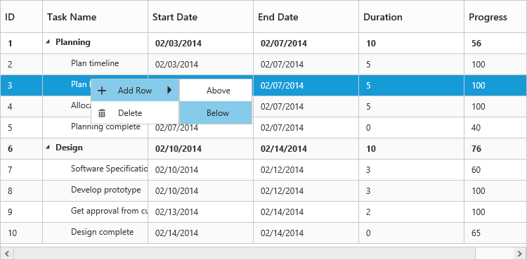
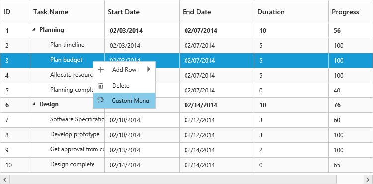

# Context Menu

The **Context menu** in tree grid control is used to manipulate (add, edit, and delete) the tree grid rows. In tree grid, context menu can be enabled with the [`e-contextmenusettings`](/api/js/ejtreegrid#contextmenusettingsspan-classtype-signature-type-objectobjectspan "contextMenuSettings") property. The `e-contextmenusettings` property contains two inner properties [`e-showcontextmenu`](/api/js/ejtreegrid#contextmenusettingsshowcontextmenuspan-classtype-signature-type-booleanbooleanspan "contextMenuSettings.showContextMenu") and [`contextMenuItems`](/api/js/ejtreegrid#contextmenusettingscontextmenuitemsspan-classtype-signature-type-arrayarrayspan "contextMenuSettings.contextMenuItems").

The `showContextMenu` property is used to **enable or disable** the context menu, default value for this property is `false`.

The `contextMenuItems` property is used to add the menu items to context menu, this property renders `Add` and `Delete` options by default when the menu items are not provided.



<body ng-controller="TreeGridCtrl">
    <!--Add  treegrid control here-->
    

    

    
</body>



The following screenshot displays the context menu in tree grid control:       

### ContextMenu Customization

Context menu can be customized by adding a new custom menu item to it. In tree grid, context menu can be customized using the [`e-contextmenuopen`](/api/js/ejtreegrid#contextmenuopen "contextMenuOpen") client side event. This event is triggered when the context menu is rendered with mouse right click action. The following properties are available in the event:

* headerText: Displays text for menu item.
* menuId: Provides ID field for the created DOM element for custom menu item.
* iconPath: Image location for menu item.
* eventHandler: Client side event for menu item click.



<body ng-controller="TreeGridCtrl">
    <!--Add  treegrid control here-->
    

    

    
</body>



The following screenshot displays the customization of context menu in tree grid control:

