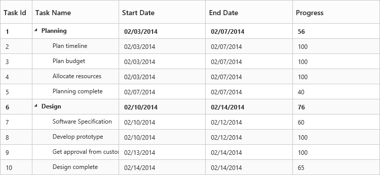
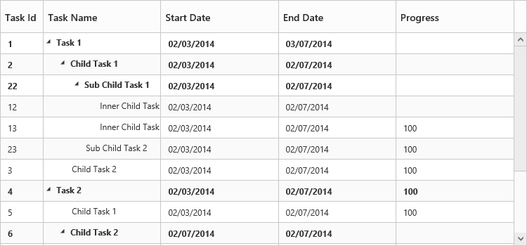

# Data Binding

Data Binding is the process that establishes a connection between the application and different kinds of data source such as business objects.

## Local Data Binding

In Local Data Binding, datasource for rendering the tree grid control is retrieved from the same application locally.

Two types of Data Binding are possible with tree grid control:     

* Hierarchical Datasource Binding                                                             
* Self-Referential Data Binding (Flat Data)

### Hierarchy Datasource Binding

The following code example shows how to bind the hierarchical local data into the tree grid control.



<body ng-controller="TreeGridCtrl">
    <!--Add  treegrid control here-->
    

    

    
</body>

                       

The output of previous steps is as follows:                                                                                                                        

###Self-Referential Data Binding (Flat Data)

Tree grid is rendered from Self-Referential data structures by providing two fields:

* **ID Field**: Contains unique values used to identify the nodes. Its name is assigned to the [`e-idmapping`](/api/js/ejtreegrid#idmappingspan-classtype-signature-type-stringstringspan "idMapping") property.
* **Parent ID Field**: Contains values that indicate parent nodes. Its name is assigned to the [`e-parentidmapping`](/api/js/ejtreegrid#parentidmappingspan-classtype-signature-type-stringstringspan "parentIdMapping") property.



<body ng-controller="TreeGridCtrl">
    <!--Add  treegrid control here-->
    

    

    
</body>



The following screenshot shows the output of previous steps:

