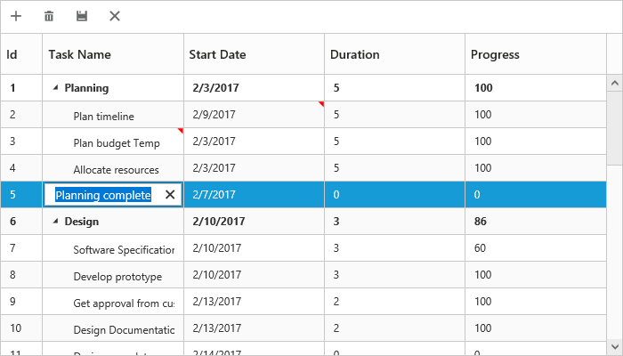

# Editing

The tree grid control provides built-in support for editing cell items.    

## Cell Editing

Update the task details through cell editing by setting [`editMode`](https://help.syncfusion.com/api/js/ejtreegrid#members:editsettings-editmode "editSettings.editMode") to `cellEditing`.
             
The following code example shows how to enable `cellEditing` in the tree grid control.                               



<body ng-controller="TreeGridCtrl">
    <!--Add  treegrid control here-->
    

    

    
</body>


The output of the tree grid with `cellEditing` is as follows:                                                                  

### Batch Editing

The batch editing support in the tree grid is used to save all added, edited, and deleted changes to the database with a single action. This can be enabled by setting the [`editMode`](https://help.syncfusion.com/api/js/ejtreegrid#members:editsettings-editmode) property to `batchEditing`. The following code example shows how to enable the batchEditing in the tree grid control.







angular.module('listCtrl', ['ejangular'])
       .controller('TreeGridCtrl', function ($scope) {
           $scope.editSettings = { allowEditing: true, editMode: "batchEditing"};
       });



The output of a tree grid with `batchEditing` is as follows.

In batch editing, the edit mode can be changed to **cell** or **row** or **dialog** with the [`batchEditSettings.editMode`](https://help.syncfusion.com/api/js/ejtreegrid#members:editsettings-batcheditsettings-editmode) property. The following code snippet shows how to set the editMode to row in the [`batchEditSettings`](https://help.syncfusion.com/api/js/ejtreegrid#members:editsettings-batcheditsettings) property.



<ej-treegrid id="TreeGridControl"
    [editSettings]= "editSettings">
</ej-treegrid>





angular.module('listCtrl', ['ejangular'])
       .controller('TreeGridCtrl', function ($scope) {
           $scope.editSettings = {batchEditSettings:{editMode : ej.TreeGrid.BatchEditMode.Row};
       });



The output of a tree grid with `batchEditSettings` and `editMode` set as `row` is as follows.

N> After modifying all changes in the tree grid, click the save button in the toolbar. The [`actionComplete`](https://help.syncfusion.com/api/js/ejtreegrid#events:actioncomplete) event will be triggered with updated records in the `batchChanges` argument with `requestType` argument as `batchSave`. Using this event, you can update all the modified records to the database.

