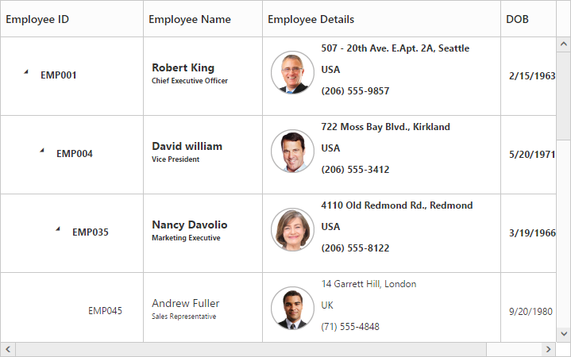
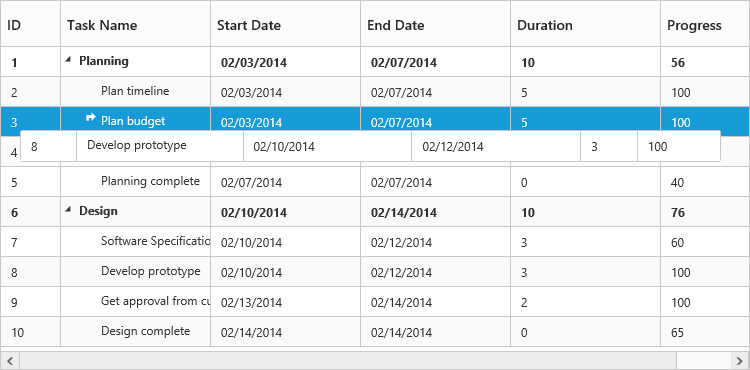
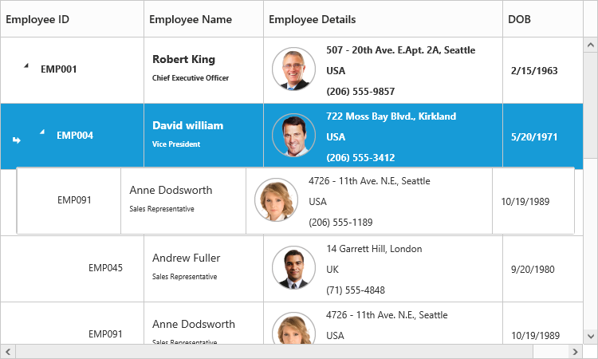

# Rows

The **TreeGrid** rows displays the information of each row from the bounded data source.

## Row Template

Row template is used to customize the **TreeGrid** rows based on requirements. In tree grid, the [`e-rowtemplateid`](/api/js/ejtreegrid#rowtemplateidspan-classtype-signature-type-stringstringspan "rowTemplateID") and [`e-altrowtemplateid`](/api/js/ejtreegrid#altrowtemplateidspan-classtype-signature-type-stringstringspan "altRowTemplateID") properties are used to customize the row.

The `e-rowtemplateid` property is used to customize all the rows in tree grid. Provide the ID of row template for this property. 

The `e-altrowtemplateid` property is used to customize the alternative rows in tree grid. Provide the ID of alternative row template for this property.

<head>
.e-treegrid .e-selectionbackground {
        background-color: #CED8F6;
        }

      .border {
        border-color: #BDBDBD;
        border-width: 1px;
        border-style: solid;
       }
</head>
<body ng-controller="TreeGridCtrl">
    <!--Add  treegrid control here-->
    

    

    
</body>




      

 var treeData = [{
            "Name": "Robert King",
            "Full Name": "Robert King",
            "Designation": "Chief Executive Officer",
            "EmployeeID": "EMP001",
            "Address": "507 - 20th Ave. E.Apt. 2A, Seattle",
            "Contact": "(206) 555-9857",
            "Country": "USA",
            "DOB": "2/15/1963",

            "Children": [{
                "Name": "David William",
                "Full Name": "David William",
                "Designation": "Vice President",
                "EmployeeID": "EMP004",
                "Address": "722 Moss Bay Blvd., Kirkland",
                "Country": "USA",
                "Contact": "(206) 555-3412",
                "DOB": "5/20/1971",
                 // ...

            }]
        }];

<body ng-controller="TreeGridCtrl">
    <!--Add  treegrid control here-->
    

    

    
</body>


The output of tree grid with **Row Template** is as follows:

## Row Drag and Drop

You can re-arrange the rows dynamically in the tree grid control by using the [`e-allowdraganddrop`](/api/js/ejtreegrid#allowdraganddropspan-classtype-signature-type-booleanbooleanspan "allowDragAndDrop") property. With this property, row drag and drop can be enabled or disabled. Rows can be inserted above and below as a sibling or child to the existing row with the help of this feature. A default tooltip is rendered while dragging the tree grid row and this tooltip can be customized by the [`e-dragtooltip`](/api/js/ejtreegrid#dragtooltipspan-classtype-signature-type-objectobjectspan "dragTooltip") property. This property has inner properties such as [`showTooltip`](/api/js/ejtreegrid#dragtooltipshowtooltipspan-classtype-signature-type-booleanbooleanspan "dragTooltip.showTooltip"), [`tooltipItems`](/api/js/ejtreegrid#dragtooltiptooltipitemsspan-classtype-signature-type-arrayarrayspan "dragTooltip.tooltipItems"), and [`tooltipTemplate`](/api/js/ejtreegrid#dragtooltiptooltiptemplatespan-classtype-signature-type-stringstringspan "dragTooltip.tooltipTemplate").

The `showTooltip` property is used to enable or disable the tooltip. By default, this property value is `false`.

The following code explains about enabling the row drag and drop with the default tooltip in the tree grid.



<body ng-controller="TreeGridCtrl">
    <!--Add  treegrid control here-->
    

    

    
</body>



The following screenshot depicts a row drag and drop in the tree grid widget.

                            

### Customizing Drag tooltip

The `tooltipItems` property is used to customize the tooltip items. By using this property, specific fields and all the defined field items can be rendered in the tooltip. By default, this property value is `null`.

The following code shows how to render row drag tooltip with the desired field items.         



<body ng-controller="TreeGridCtrl">
    <!--Add  treegrid control here-->
    

    

    
</body>



The `tooltipTemplate` property renders the template tooltip for row drag and drop in the tree grid control by using the JsRender template. You can provide either ID value of the script element or script element to the property.       

The following code shows how to render row drag tooltip with tooltip template.	



      





<body ng-controller="TreeGridCtrl">
    <!--Add  treegrid control here-->
    

    

    
</body>



