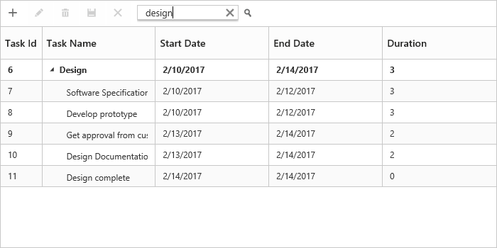

## Searching

The TreeGrid control has an option to search its content using toolbar search box. The toolbar search box can be enabled by using the `toolbarItems` in [`e-toolbarsettings`](/api/js/ejtreegrid#members:toolbarsettings) property. The following code example explains how to integrate search textbox in toolbar.

  
           

            


var toolbarSettings =
{
    toolbarItems: [        
            ej.TreeGrid.ToolbarItems.Search
        ],
}       
angular.module('listCtrl', ['ejangular'])
       .controller('TreeGridCtrl', function ($scope) {      
              $scope.toolbarSettings = toolbarSettings;
        });
    </script>   
</body>


The below screenshot shows TreeGrid search with `plan` key word.

## Search Hierarchy Modes

The tree grid supports different types of search mode through the `searchHierarchyMode`of [`e-searchsettings`](/api/js/ejtreegrid#members:searchsettings-searchhierarchymode) property.

The following are the types of search modes available in the tree grid.

**Parent**: This is the default search hierarchy mode in the tree grid. It displays a searched record with its parent records. If the searched records do not have any parent record, it displays only the searched record.

**Child**: Displays the searched record with its child record. If the searched records do not have any child record, it displays only the searched record.

**Both**: Displays the searched record with both its parent and child records. If the searched records do not have any parent and child records, it displays only the searched record.

**None**: Displays only the searched record.

The following code example shows how to set the `searchHierarchyMode` in the tree grid.







     angular.module('listCtrl', ['ejangular'])
        .controller('TreeGridCtrl', function ($scope) {
            $scope.searchSettings = searchSettings;
            //…
        });



The following image depicts the output of the previous code example.

The above screenshot shows Tree Grid with `child` search mode.

