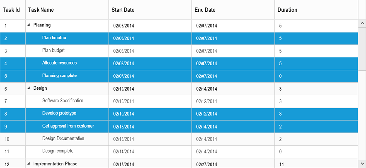
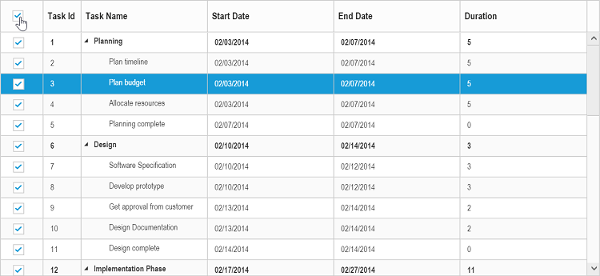
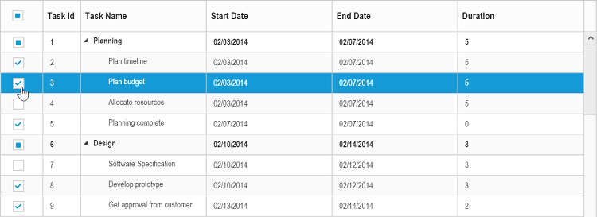
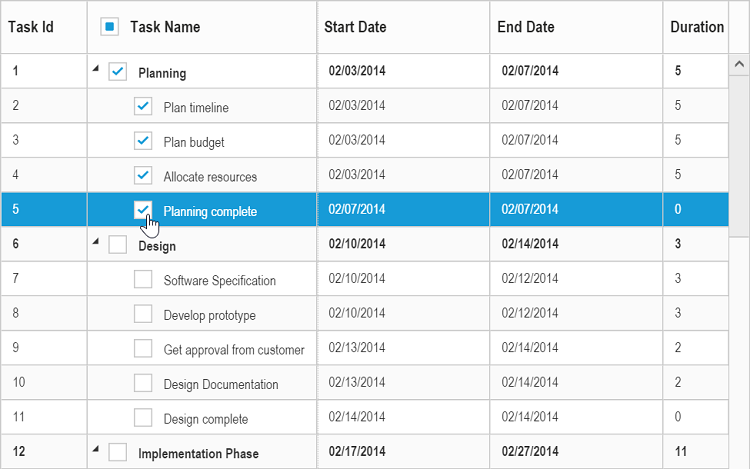

# Selection

The tree grid control provides support for row and cell selections.                  

## Row selection

You can enable or disable the row selection in tree grid using the `e-allowselection` property. By default, row selection is enabled in tree grid.
The following code example shows how to disable the row selection in tree grid.                                        



<body ng-controller="TreeGridCtrl">
    <!--Add  treegrid control here-->
    

    

</body>



The output of the tree grid with row selection is as follows:

### Selecting a row at initial load

You can select a row at initial load by setting the index of row to the `e-selectedrowindex` property. This is demonstrated as follows.
                     



<body ng-controller="TreeGridCtrl">
    <!--Add  treegrid control here-->
    

    

</body>



### Multiple row selection

You can also select multiple rows by setting the `e-selectionsettings.selectionType` to `multiple`. More than one row can be selected by holding down `CTRL` key and clicking the rows.
The following code example explains how to enable multiple selection in tree grid.               



<body ng-controller="TreeGridCtrl">
    <!--Add  treegrid control here-->
    

    

    
</body>



The output of the tree grid with multiple row selection is as follows:

To enable multiple selection, set the `e-selectionsettings.selectionType` property to `multiple` or enumeration value `ej.TreeGrid.SelectionType.Multiple`.      

### Selecting a row programmatically 

You can select a row programmatically by setting the row index value to the `e-selectedrowindex` property.                             
The following code shows how to select a row programmatically with button click action.       



    <html>
        <body>
        <button id="selectRow">SelectRow</button>
        //...
         

    

        </body>
    </html>




    
     $("#selectRow").click(function (args) {
         $("#TreeGridContainer ").ejTreeGrid("option", "selectedRowIndex", 4);           
     })



## Cell selection

You can select cells in tree grid by setting the `e-selectionsettings.selectionMode` property to `cell`.
The following code sample helps you to enable the cell selection in tree grid.                                                    



<body ng-controller="TreeGridCtrl">
    <!--Add  treegrid control here-->
    

    

    
</body>



The output of the tree grid with cell selection is as follows:

### Multiple cell selection

You can also select multiple cells by setting the `e-selectionsettings.selectionType` property to `multiple`. 
Multiple selection can be done by holding the `CTRL` key and clicking required cells. 
The following code example shows you to select multiple cells.                            



<body ng-controller="TreeGridCtrl">
    <!--Add  treegrid control here-->
    

    

    
</body>



The output of the tree grid with multiple cell selection is as follows:

### Selecting cells programmatically 

You can select the cells programmatically using the `selectCells` public method. This is demonstrated as follows.


    <html>
        <body>
         <button id="selectcells">SelectCells</button>
         //...
         

         

        </body> 
    </html>


  

     $("#selectCells").click(function (args) {
            //create TreeGrid object
            var TreeGridObj = $("#TreeGridContainer").data("ejTreeGrid");
            cellIndex = [{ rowIndex: 2, cellIndex: 1 }, {rowIndex:3,cellIndex:1}];
            TreeGridObj.selectCells(cellIndex);
     })


## Checkbox selection

Tree grid supports checkbox selection. To enable the checkbox selection, set the `e-selectionsettings.selectionType` property to `checkbox` and the `e-selectionsettings.selectionMode` property to `row`. When checkbox selection is enabled, the checkbox column will be displayed as the left most column by default.
### Column header checkbox

You can select or unselect all the tree grid rows using column header checkbox. To enable this, set the `e-selectionsettings.enableSelectAll` property to `true`. The following code sample explains how to enable the column header checkbox.



<body ng-controller="TreeGridCtrl">
    <!--Add  treegrid control here-->
    

    

    
</body>


The output of the tree grid with checkbox enabled in column header is as follows:

### Hierarchy selection
You can select the rows hierarchically using checkboxes in tree grid by enabling the `e-selectionsettings.enableHierarchySelection` property.
In this selection the hierarchy between the records will be retained, where the child records are selected by selecting its parent record’s checkbox and parent record checkbox is selected by checking all of its child items.                                           

The following code sample explains enabling hierarchy selection in tree grid.             



<body ng-controller="TreeGridCtrl">
    <!--Add  treegrid control here-->
    

    

    
</body>



The output of the tree grid with hierarchy selection enabled is as follows:

### Checkbox column

You can change the default index of the checkbox column and display the checkboxes in any of the existing column. To enable the checkbox in any of the column, set the  `showCheckbox` property to true in the column object.



<body ng-controller="TreeGridCtrl">
    <!--Add  treegrid control here-->
    

    

    
</body>


The output of the tree grid with checkbox enabled in task name column is as follows:

