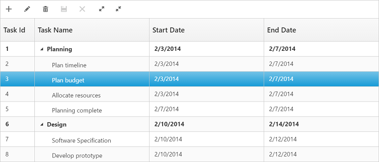
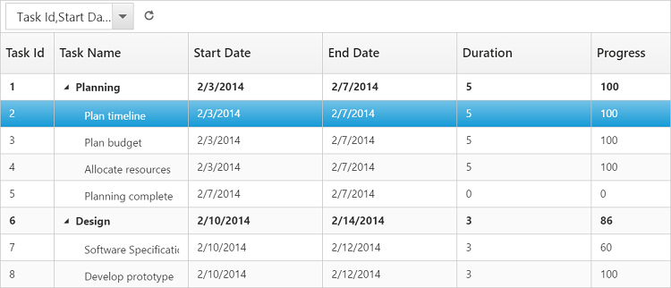

# Toolbar

In tree grid you can show or hide the Toolbar by using the [`toolbarSettings.showToolbar`](https://help.syncfusion.com/api/js/ejtreegrid#members:toolbarsettings-showtoolbar "showToolbar") property. You can add default toolbar items by the [`toolbarSettings.toolbarItems`](https://help.syncfusion.com/api/js/ejtreegrid#members:toolbarsettings-toolbaritems "toolbarItems"). You can also create a custom toolbar items by using the [`toolbarSettings.customToolbarItems`](https://help.syncfusion.com/api/js/ejtreegrid#members:toolbarsettings-customToolbarItems "customToolbarItems") property.

## Default Toolbar Items
Using tree grid default toolbar items, you can perform the following operations:  

* **Add**: Adds new task.

* **Edit**: Edits a selected task.

* **Delete**: Deletes a selected task.
		   
* **Cancel**: Cancels the edited changes in a task.
		   
* **Update**: Saves the edited changes in a task.
		   
* **ExpandAll**: Expands all the tree grid rows.
		   
* **CollapseAll**: Collapses all the tree grid rows.
		   
* **PdfExport**: Exports tree grid in PDF format.
		   
* **ExcelExport**: Exports tree grid in Excel format.

You can enable tree grid toolbar by using the following code example.

    <body ng-controller="TreeGridCtrl">                
           

            
       
</body>

The following screenshot displays the toolbar option in tree grid control:

N> To perform add,edit,delete,cancel, and update using Toolbar items, enable add/edit/delete using [`editSettings`](https://help.syncfusion.com/api/js/ejtreegrid#members:editsettings "editSettings").
  
## Custom Toolbar Items

CustomToolbarItems allows you to insert custom icons and custom template in tree grid toolbar. By using the following properties, you can customize tree grid toolbar as per your requirement.

* **text**: Inserts the custom icons in toolbar using the CSS class name selector.                               

* **templateID**: Inserts the custom icons in toolbar using script templates. Using this property you can bind HTML elements and other EJ controls to tree grid toolbar.

* **tooltipText**: Displays tooltip text for the custom icons. 

To insert EJ Controls in tree grid toolbar, initiate the control in the [`create`](https://help.syncfusion.com/api/js/ejtreegrid#events:create "create") client side event. In the [`toolbarClick`](https://help.syncfusion.com/api/js/ejtreegrid#events:toolbarclick "toolbarclick") client side event, you can bind actions to the custom toolbar items.


<body ng-controller="TreeGridCtrl">
                    
           

            
            
    
    
</body>
	

