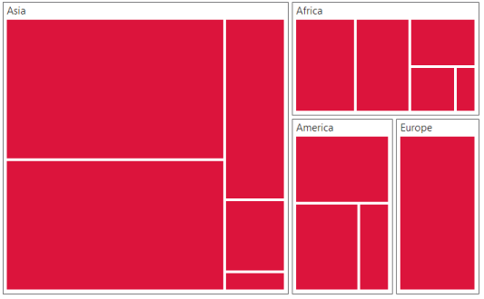
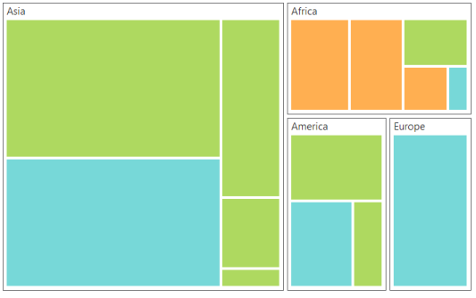

# Customization

**TreeMap** control supports color customization to determine the exact combination of colors for tree nodes displayed in **TreeMap** and tooltip support to display additional information of treemap data.

## Color

You can customize the colors of the leaf nodes of **TreeMap** using the ColorMapping support of the **TreeMap**. 

ColorMapping is categorized into three different types such as,

* `e-uniColorMapping`
* `e-rangeBrushColorMapping`
* `e-desaturationColorMapping`

### Uni Color Mapping

You can color, all the leaf nodes with the same color by setting the `color` value of the `e-uniColorMapping` property of the **TreeMap**.



 
 <html xmlns="http://www.w3.org/1999/xhtml" lang="en" ng-app="TreemapApp">
    <head>
        <title>Essential Studio for AngularJS: TreeMap</title>
        <!--CSS and Script file References -->
    </head> 
    <body ng-controller="TreemapCtrl">
    

    <ej-treemap e-unicolormapping-color="Crimson">
    </ej-treemap>
    

    
    </body>
</html>     



### Range Color Mapping

You can group the leaf nodes based on the range of the data’s color values. You can set a unique color for every ranges. To achieve this, specify the `e-to` and `e-from` values as range bound and `e-color` or `e-gradientcolors` value to fill the leaf nodes of the particular range, through the `e-rangeColorMapping` property of the **TreeMap**.



 <html xmlns="http://www.w3.org/1999/xhtml" lang="en" ng-app="TreemapApp">
    <head>
        <title>Essential Studio for AngularJS: TreeMap</title>
        <!--CSS and Script file References -->
    </head> 
    <body ng-controller="TreemapCtrl">
     

     <ej-treemap>
     <e-rangecolormapping>
     <e-rangecolor e-color="#77D8D8" e-from="0" e-to="1"></e-rangecolor>
     <e-rangecolor e-color="#AED960" e-from="0" e-to="2"></e-rangecolor>
     <e-rangecolor e-color="#FFAF51" e-from="0" e-to="3"></e-rangecolor>
     <e-rangecolor e-color="#F3D240" e-from="0" e-to="4"></e-rangecolor>
     </e-rangecolormapping>
     </ej-treemap>
     

     
    </body>
</html>     



### Desaturation Color Mapping

You can differentiate all the leaf nodes using the `e-desaturationColorMapping` property of the **TreeMap**. Differentiation is achieved, even though same color is applied for all the leaf nodes by varying the opacity of the leaf nodes based on the color value specified in the color value range using `e-desaturationColorMapping-rangeMinimum` and `e-desaturationColorMapping-rangeMaximum` value of the data collection. You can also bound the opacity range by setting `e-desaturationColorMapping-from` and `e-desaturationColorMapping-to` property of the `e-desaturationColorMapping`.



 <html xmlns="http://www.w3.org/1999/xhtml" lang="en" ng-app="TreemapApp">
    <head>
        <title>Essential Studio for AngularJS: TreeMap</title>
        <!--CSS and Script file References -->
    </head> 
    <body ng-controller="TreemapCtrl">
     

     <ej-treemap e-desaturationcolormapping-color="DeepSkyBlue" e-desaturationcolormapping-from="1"
     e-desaturationcolormapping-to="0.2" e-desaturationcolormapping-rangeMinimum="0" 
     e-desaturationcolormapping-rangeMaximum="4">
     </ej-treemap>
     

     
    </body>
</html>     



## Tooltip

You can enable the tooltip support for the TreeMap by setting the `e-showTooltip` property to true. By default, it takes the property of the bound object that is referred to in the groupPath and displays its content when the corresponding node is tapped. The `e-tooltipTemplate` is a **HTML** element that is used to expose the custom template for the tooltip.

## Leaf Item Setting

You can customize the **Leaf level TreeMap items** using `e-leafItemSettings`. In leafItemSettings following customization options are available.

* You can specify the border color using `e-leafitemsettings-borderBrush` property.

* For customizing border thickness, you can use `e-leafitemsettings-borderThickness` property.

* To customize the gap between the leaf items, you can use `e-leafitemsettings-gap` property.

* You can specify the label template for the leaf item using `e-leafitemsettings-itemTemplate` property.

* The Label and tooltip values take the property of bound object that is referred in the `e-leafitemsettings-labelPath` when defined.

* You can specify the position of the leaf labels using `e-leafitemsettings-labelPosition` property.

* You can control the mode of label visibility of the labels using `e-leafitemsettings-labelVisibilityMode` property.

* To show or hide the visibility of the leaf item labels you can use `e-leafitemsettings-showLabels` property.

* For specifying over flow action of left item labels you can use `e-leafitemsettings-textOverFlow` property.



<html xmlns="http://www.w3.org/1999/xhtml" lang="en" ng-app="TreemapApp">
    <head>
        <title>Essential Studio for AngularJS: TreeMap</title>
        <!--CSS and Script file References -->
    </head> 
    <body ng-controller="TreemapCtrl">
     

     <ej-treemap e-datasource=populationdata e-colorValuePath="Growth" e-weightvaluepath="Population"
     e-leafitemsettings-labelPath="Region" e-showtooltip="true" e-tooltiptemplate="template">
     <e-rangecolormapping>
     <e-rangecolor e-color="#77D8D8" e-from="0" e-to="1"></e-rangecolor>
     <e-rangecolor e-color="#AED960" e-from="0" e-to="2"></e-rangecolor>
     <e-rangecolor e-color="#FFAF51" e-from="0" e-to="3"></e-rangecolor>
     <e-rangecolor e-color="#F3D240" e-from="0" e-to="4"></e-rangecolor>
     </e-rangecolormapping>
     <e-levels>
     <e-level e-grouppath="Continent" e-groupgap="5"></e-level>
     </e-levels>
     </ej-treemap>
     

     
    
    </body>
</html> 
   
    



## Border Brush

You can able to customize the border color of the treemap using the property `e-borderBrush`. 



  <html xmlns="http://www.w3.org/1999/xhtml" lang="en" ng-app="TreemapApp">
    <head>
        <title>Essential Studio for AngularJS: TreeMap</title>
        <!--CSS and Script file References -->
    </head> 
    <body ng-controller="TreemapCtrl">
     

     <ej-treemap e-borderbrush="white">    
     </ej-treemap>
     

     
    </body>
</html> 



## Border Thickness

For customizing the border thickness of the treemap, you can use the `e-borderThickness` property.


 
  <html xmlns="http://www.w3.org/1999/xhtml" lang="en" ng-app="TreemapApp">
    <head>
        <title>Essential Studio for AngularJS: TreeMap</title>
        <!--CSS and Script file References -->
    </head> 
    <body ng-controller="TreemapCtrl">
     

     <ej-treemap e-borderthickness="1">    
     </ej-treemap>
     

     
    </body>
</html> 



## Dock Position

You can position the legend at top, bottom, left and right side of the treemap as per your requirement. For changing the position as per your requirement, you can use `e-legendSettings-dockPosition` property.

<ts name="ej.datavisualization.TreeMap.DockPosition"/>
Specifies the dockPosition for legend

<table class="params">
	<thead>
		<tr>
			<th>Name </th>			
			<th>Description</th>
		</tr>
	</thead>
	<tbody>
		<tr>
			<td class="name">top</td>			
			<td class="description">specifies the top position</td>
		</tr>
		<tr>
			<td class="name">bottom</td>			
			<td class="description">specifies the bottom position</td>
		</tr>
    <tr>
			<td class="name">right</td>			
			<td class="description">specifies the bottom position</td>
		</tr>
    <tr>
			<td class="name">left</td>			
			<td class="description">specifies the left position</td>
		</tr>
	</tbody>
</table>


 
  <html xmlns="http://www.w3.org/1999/xhtml" lang="en" ng-app="TreemapApp">
    <head>
        <title>Essential Studio for AngularJS: TreeMap</title>
        <!--CSS and Script file References -->
    </head> 
    <body ng-controller="TreemapCtrl">
     

     <ej-treemap e-legendsettings-dockposition="top">    
     </ej-treemap>
     

     
    </body>
</html> 



## Clicking and Dragging

You can select the single treemap element on click and drag. To click and drag treemap items, you have to enable the `e-draggingOnSelection` property.


 
  <html xmlns="http://www.w3.org/1999/xhtml" lang="en" ng-app="TreemapApp">
    <head>
        <title>Essential Studio for AngularJS: TreeMap</title>
        <!--CSS and Script file References -->
    </head> 
    <body ng-controller="TreemapCtrl">
     

     <ej-treemap e-draggingonselection="false">    
     </ej-treemap>
     

     
    </body>
</html> 



For selecting the group element of treemap while clicking and dragging, you can use `e-draggingGroupOnSelection` property.



  <html xmlns="http://www.w3.org/1999/xhtml" lang="en" ng-app="TreemapApp">
    <head>
        <title>Essential Studio for AngularJS: TreeMap</title>
        <!--CSS and Script file References -->
    </head> 
    <body ng-controller="TreemapCtrl">
     

     <ej-treemap e-dragginggrouponselection="false">    
     </ej-treemap>
     

     
    </body>
</html>



## Fill with Gradient

You can customize that whether gradient color have to be applied for treemap or not. This can be customized using the property `e-enableGradient`.


 
  <html xmlns="http://www.w3.org/1999/xhtml" lang="en" ng-app="TreemapApp">
    <head>
        <title>Essential Studio for AngularJS: TreeMap</title>
        <!--CSS and Script file References -->
    </head> 
    <body ng-controller="TreemapCtrl">
     

     <ej-treemap e-enablegradient="true">    
     </ej-treemap>
     

     
    </body>
</html>



## Responsive Treemap

You can customize whether treemap have to be responsive or not while resizing the container. For making treemap responsive you can use `e-enableResize` or `e-isResponsive` property.


 
  <html xmlns="http://www.w3.org/1999/xhtml" lang="en" ng-app="TreemapApp">
    <head>
        <title>Essential Studio for AngularJS: TreeMap</title>
        <!--CSS and Script file References -->
    </head> 
    <body ng-controller="TreemapCtrl">
     

     <ej-treemap e-enableresize="true">    
     </ej-treemap>
     

     
    </body>
</html>



## GroupColorMapping

You can customize the color of the each group using `e-groupColorMapping` property. To use group color mapping, kindly specify `e-groupId` and `e-rangeColorMapping` inside the `e-groupColorMapping`. 



  <html xmlns="http://www.w3.org/1999/xhtml" lang="en" ng-app="TreemapApp">
    <head>
        <title>Essential Studio for AngularJS: TreeMap</title>
        <!--CSS and Script file References -->
    </head> 
    <body ng-controller="TreemapCtrl">
     

     <ej-treemap e-groupcolormapping=groupColorMapping>    
     </ej-treemap>
     

     
    </body>
</html>



## GroupSelectionMode

You can specifies the selection mode of the treemap using `e-groupSelectionMode` property. You can set either group selection mode value as `Default` or  `Multiple`. 



  <html xmlns="http://www.w3.org/1999/xhtml" lang="en" ng-app="TreemapApp">
    <head>
        <title>Essential Studio for AngularJS: TreeMap</title>
        <!--CSS and Script file References -->
    </head> 
    <body ng-controller="TreemapCtrl">
     

     <ej-treemap e-groupselectionmode="Default">    
     </ej-treemap>
     

     
    </body>
</html>



## Header

You can specify the header for the parent item using the property `e-header`. This is applicable only for hierarchical data source. 



  <html xmlns="http://www.w3.org/1999/xhtml" lang="en" ng-app="TreemapApp">
    <head>
        <title>Essential Studio for AngularJS: TreeMap</title>
        <!--CSS and Script file References -->
    </head> 
    <body ng-controller="TreemapCtrl">
     

     <ej-treemap e-header="Country">    
     </ej-treemap>
     

     
    </body>
</html>



## Specifying HierarchicalDatasource

You can specify whether data source bound for the treemap is hierarchical or not using the property `e-isHierarchicalDatasource`](../api/ejtreemap#members:isHierarchicalDatasource).



  <html xmlns="http://www.w3.org/1999/xhtml" lang="en" ng-app="TreemapApp">
    <head>
        <title>Essential Studio for AngularJS: TreeMap</title>
        <!--CSS and Script file References -->
    </head> 
    <body ng-controller="TreemapCtrl">
     

     <ej-treemap e-ishierarchicaldatasource="true">    
     </ej-treemap>
     

     
    </body>
</html>



## Localization

You can specify the name of the culture based on which treemap is localized. To achieve this you can use the treemap property `e-locale`.


         
  <html xmlns="http://www.w3.org/1999/xhtml" lang="en" ng-app="TreemapApp">
    <head>
        <title>Essential Studio for AngularJS: TreeMap</title>
        <!--CSS and Script file References -->
    </head> 
    <body ng-controller="TreemapCtrl">
     

     <ej-treemap e-locale="en-US">    
     </ej-treemap>
     

     
    </body>
</html>



## Treemap Items

You can specify the treemap items which you want to display in the treemap using the property `e-treeMapItems`.



  <html xmlns="http://www.w3.org/1999/xhtml" lang="en" ng-app="TreemapApp">
    <head>
        <title>Essential Studio for AngularJS: TreeMap</title>
        <!--CSS and Script file References -->
    </head> 
    <body ng-controller="TreemapCtrl">
     

     <ej-treemap e-treemapitems=treeMapItem>    
     </ej-treemap>
     

     
    </body>
</html>
  
