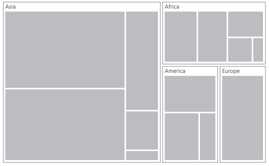

# TreeMapLevels

The levels of **TreeMap** can be categorized into two types as,

* FlatLevel
* Hierarchical Level

Following customization options are available to customize the treemap level as per your requirements.

* To specify the background color for the group, you can use `e-groupBackground` property.

* To specify the border color for the group, you can use `e-groupBorderColor` property.

* To maintain the border thickness for the group, you can use `e-groupBorderThickness` property.

* You can specify the gaps between groups using `e-groupGap` property.

* You can specify the padding using `e-groupPadding` property.

* For specifying the header height, you can use `e-headerHeight` property.

* You can customize the header template using `e-headerTemplate` property.

* To specify the label position, you can use `e-labelPosition` property.

* To specify the label template for treemap, you can use `e-labelTemplate` property.

* You can specify the label visibility using `e-labelVisibilityMode` property.

* You can control the label visibility using `e-showLabels` property.

* For controlling text overflow, you can use `e-textOverflow` property.

## Flat Level

### GroupPath

You can use `e-groupPath` property for every flat level of the **TreeMap** control. It is a path to a field on the source object that serves as the **“Group”** for the level specified. You can group the data based on the `e-groupPath` in the **TreeMap** control. When the `e-groupPath` is not specified, then the items are not grouped and the data is displayed in the order specified in the `e-dataSource`.

### GroupGap

You can use `e-groupGap` property to separate the items from every flat level and to differentiate the levels mentioned in the **TreeMap** control.



<html xmlns="http://www.w3.org/1999/xhtml" lang="en" ng-app="TreemapApp">
    <head>
        <title>Essential Studio for AngularJS: TreeMap</title>
        <!--CSS and Script file References -->
    </head> 
    <body ng-controller="TreemapCtrl">
     

     <ej-treemap e-datasource=populationdata e-colorValuePath="Growth" e-weightvaluepath="Population">
     <e-levels>
     <e-level e-grouppath="Continent" e-groupgap="5"></e-level>
     </e-levels>
     </ej-treemap>
     

     
    </body>
</html>



## Hierarchical Level

**TreeMap** Hierarchical level is used to define levels for hierarchical data collection that contains tree-structured data.



   <html xmlns="http://www.w3.org/1999/xhtml" lang="en" ng-app="TreemapApp">
    <head>
        <title>Essential Studio for AngularJS: TreeMap</title>
        <!--CSS and Script file References -->
    </head> 
    <body ng-controller="TreemapCtrl">
     

     <ej-treemap e-datasource=populationdata  e-weightvaluepath="Population">
     </ej-treemap>
     

      
    </body>
</html>

       



