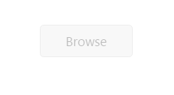

# Enables or Disables the Uploadbox 

This feature helps set the **enable** or **disable** option for **Uploadbox** by setting **Boolean** type value to [enabled](https://help.syncfusion.com/api/js/ejuploadbox#members:enabled) property. For **enable** or **disable** option, set [enabled](https://help.syncfusion.com/api/js/ejuploadbox#members:enabled) property to ‘**false**’. The data type is **Boolean**.

The following steps explain the configuration of **enabled** property in **Uploadbox**. 

In the **HTML** page, add the **&lt;div&gt;** element to configure the **Uploadbox** element.



    





angular.module('UploadboxApp', ['ejangular'])
.controller('UploadboxCtrl', function ($scope) {
    $scope.save = "saveFiles.ashx";
    $scope.remove= "removeFiles.ashx";
});



For **JS**, configure **saveFiles.ashx** and **removeFiles.ashx** files as mentioned in the Save file action and Remove file action respectively.

The following screenshot displays the output.

