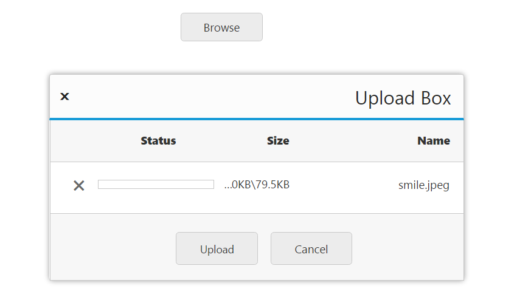

# RTL Support 

This feature supports the change of left-to-right alignment of the **Uploadbox** widget to right-to-left (**RTL**). That is, it sets the **Uploadbox** to right-to-left actions.

The following steps explain the configuration of [enableRTL](https://help.syncfusion.com/api/js/ejuploadbox#members:enablertl) property in **Uploadbox**. 

In the **HTML** page, add the **&lt;div&gt;** element to configure the **Uploadbox** element.



  




  
angular.module('UploadboxApp', ['ejangular'])
.controller('UploadboxCtrl', function ($scope) {
    $scope.save = "saveFiles.ashx";
    $scope.remove= "removeFiles.ashx";
});



For **JS**, configure **saveFiles.ashx** and **removeFiles.ashx** files as mentioned in the Save file action and Remove file action respectively.

The following screenshot displays the output.

 