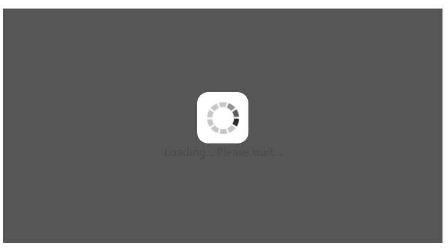
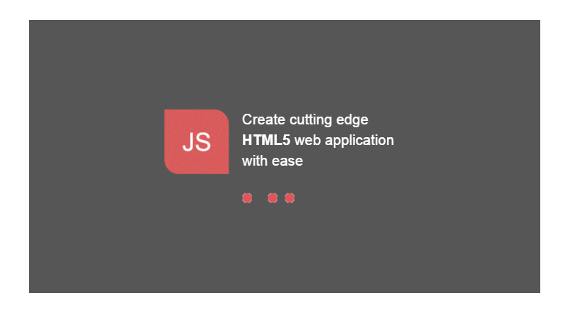
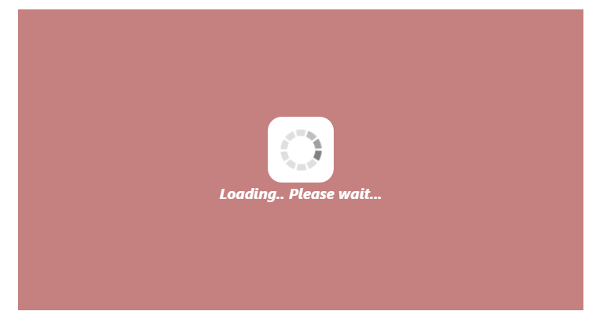

# Appearance and Styling 

## Custom Text

**WaitingPopup** control provides support for Custom Text to mention any message inside the pop-up panel. You can specify a custom text through the [text](https://help.syncfusion.com/api/js/ejwaitingpopup#members:text) property that displays when the **WaitingPopup** is loading.

The following steps explains you the configuration of the custom text for **WaitingPopup** control.

 In the **HTML** page, add a **&lt;div&gt;** element to render **WaitingPopup** widget.



 



Add the following styles to render **WaitingPopup** widget.





Execute the above code to render the following output.

 

## Template

We can customize the appearance of **WaitingPopup** widget using [template](https://help.syncfusion.com/api/js/ejwaitingpopup#members:template) support which is used to include the **HTML** content instead of the default image.

The following steps explains that how to display a text and image using template for **WaitingPopup** control.

 In the **HTML** page, add a **&lt;div&gt;** element to configure **WaitingPopup** widget.



    

  



 Add customized template for **WaitingPopup** control using the following code example.



   

      

      

         
Create cutting edge 

         
<b>HTML5</b> web application 

         
with ease 

      

   

   



Initialize the **WaitingPopup** with custom template using the following code example.



angular.module('WaitingPopupApp', ['ejangular'])
.controller('WaitingPopupCtrl', function ($scope) {
    $scope.template = "#content";
});



In **CSS**, you can configure the custom styles for **WaitingPopup**.

N> Images for this sample are available ‘installed sample location /images/waitingPopup’ and we need to define images in mentioned CSS. Henceforth the images will display.





Execute the above code to render the following output.

 

## CSS Class

You can use the **CSS** class to customize the **WaitingPopup** control appearance. Define a **CSS** class as per requirement and assign the class name to [cssClass](https://help.syncfusion.com/api/js/ejwaitingpopup#members:cssclass) property.

The following steps allows you to configure **CSS** class for an auto-complete textbox.

 In the **HTML** page, add a **&lt;div&gt;** element to configure **WaitingPopup** widget.



   

  



Define CSS class for customizing the WaitingPopup widget.





The following screenshot displays the output for the above code.

 