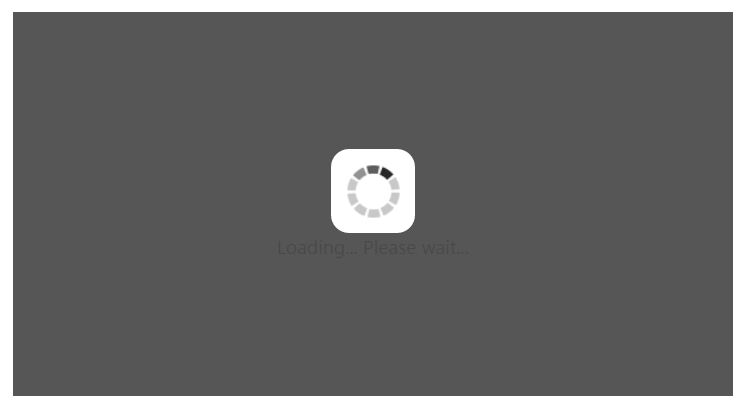
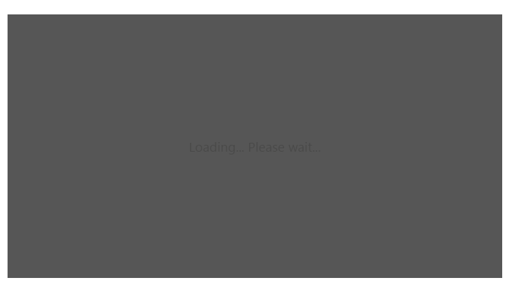

# Behavior and Settings

## Automatic Initializing WaitingPopup widget

**WaitingPopup** widget contains [showOnInit](https://help.syncfusion.com/api/js/ejwaitingpopup#members:showoninit) property that allows the popup to display over a target on page load automatically. By default, **showOnInit** property is set as false.

The following steps explains you on how to display the **WaitingPopup** on page load.

In an **HTML** page, add a **&lt;div&gt;** element to render **WaitingPopup** widget.



    

  



 Add the following styles to render **WaitingPopup** widget.





The following screenshot illustrates the **WaitingPopup** when **showOnInit** is set to “**true**”.

 

## Enable / Disable Popup Indicator

You can show or hide the popup indicator of **WaitingPopup** widget using [showImage](https://help.syncfusion.com/api/js/ejwaitingpopup#members:showimage) property. By default, **showImage** property is set as **true**.

The following steps explains you to enable / disable popup indicator in **WaitingPopup** widget.

 In the **HTML** page, add a **&lt;div&gt;** element to render **WaitingPopup** widget.



// To configure Enable / Disable popup indicator in WaitingPopup, use the following code.
    //Enable popup indicator:
    

     

    
  
    
   //Disable popup indicator:
    

     

    
  


Add the following styles to render **WaitingPopup** widget.





Execute the above code to render the following output.

 

 

## Show / Hide WaitingPopup

Using [show()](https://help.syncfusion.com/api/js/ejwaitingpopup#methods:show) and [hide()](https://help.syncfusion.com/api/js/ejwaitingpopup#methods:hide) methods, you can display or hide the **WaitingPopup** widget over the target area.

The following steps explains you to show / hide the **WaitingPopup** widget.

In the **HTML** page, add a **&lt;div&gt;** element to render **WaitingPopup** widget.



    





   //Create an instance from an existing WaitingPopup.

   // only after control creation we can get waitingPopupObj otherwise it throws exception.

    var waitingPopupObj = $("#waitingPopUp").data("ejWaitingPopup");

    //Show WaitingPopup

        waitingPopupObj.show();

    //Hide WaitingPopup

        waitingPopupObj.hide();



Add the following styles to render **WaitingPopup** widget.





The following screenshot illustrates a **WaitingPopup** when **show()** method is invoked.

